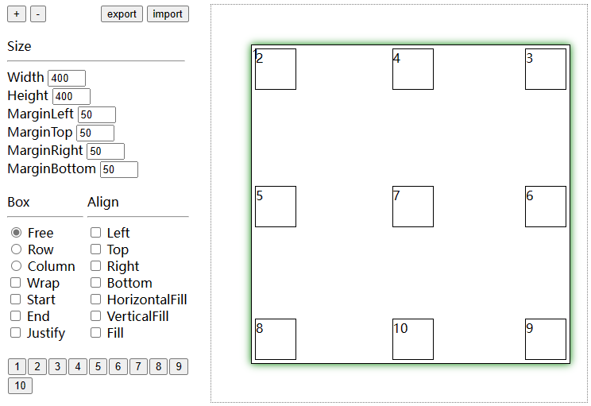

# buju

buju (布局) is a simple layout engine, based on [layout.h](https://github.com/randrew/layout)

```nim
import buju

var l = default(Layout)

let root = l.node()
l.setSize(root, vec2(50, 50))

template alignBox(n, flags) =
  let n = l.node()
  l.setSize(n, vec2(10, 10))
  l.setLayoutFlags(n, flags)
  l.insertChild(root, n)

# |2|4|3|
# |5|7|6|
# |8|10|9|

alignBox(node2, LayoutTop or LayoutLeft)
alignBox(node3, LayoutTop or LayoutRight)
alignBox(node4, LayoutTop)

alignBox(node5, LayoutLeft)
alignBox(node6, LayoutRight)
alignBox(node7, 0)

alignBox(node8, LayoutBottom or LayoutLeft)
alignBox(node9, LayoutBottom or LayoutRight)
alignBox(node10, LayoutBottom)

l.compute(root)

check l.computed(node2) == vec4(0, 0, 10, 10)
check l.computed(node3) == vec4(40, 0, 10, 10)
check l.computed(node4) == vec4(20, 0, 10, 10)

check l.computed(node5) == vec4(0, 20, 10, 10)
check l.computed(node6) == vec4(40, 20, 10, 10)
check l.computed(node7) == vec4(20, 20, 10, 10)

check l.computed(node8) == vec4(0, 40, 10, 10)
check l.computed(node9) == vec4(40, 40, 10, 10)
check l.computed(node10) == vec4(20, 40, 10, 10)

```

The [editor](https://htmlpreview.github.io/?https://github.com/haoyu234/buju/blob/main/assets/demo.html) is in `assets/demo.html`, and here is the output:

